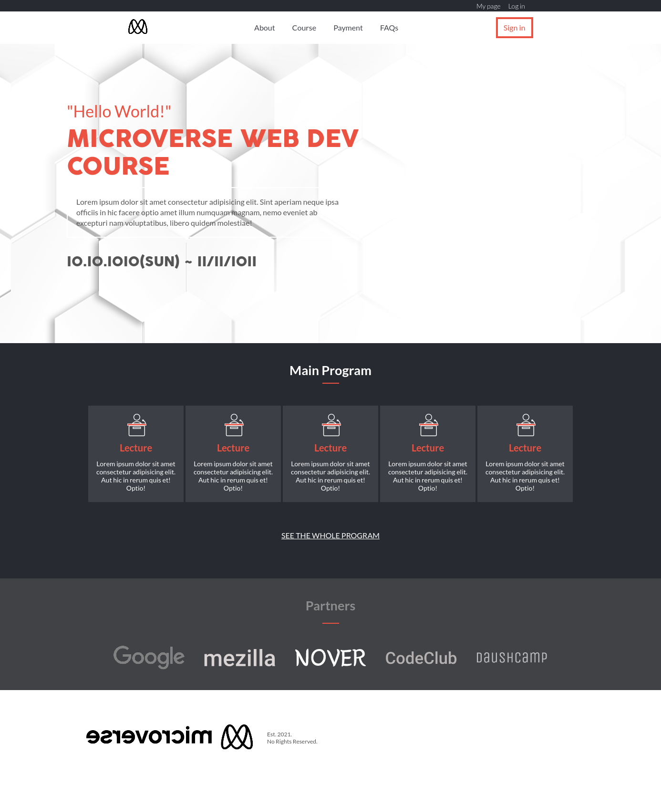
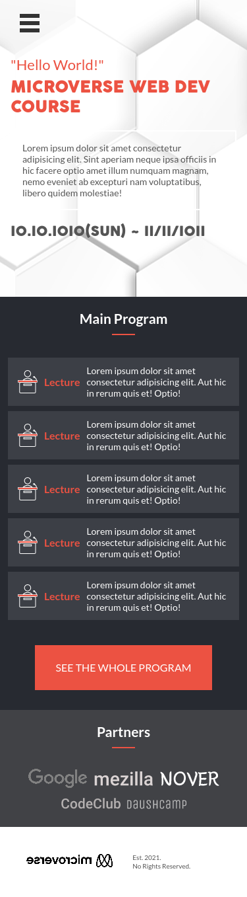

# Capstone Project

This is my first Capstone Project.

This is a general page that can be used to sell courses, festivals, bootcamps, among other things.
It has a double header to navigate between website login pages and website content pages.

Only the Home and About pages were created.

You can have a look at them through this link: https://leonardodiasb.github.io/Capstone-1-Course-Page/

  

https://www.loom.com/share/a56f4c4881ee46278056f6f71345a872
.....

## Built With

- HTML
- CSS
- JS

👤 **Author**

- GitHub: [@leonardodiasb](https://github.com/leonardodiasb)

## Credits

Original design idea by [Cindy Shin in Behance](https://www.behance.net/adagio07)

## 🤝 Contributing

Contributions, issues, and feature requests are welcome!

## Show your support

Give a ⭐️ if you like this project!
